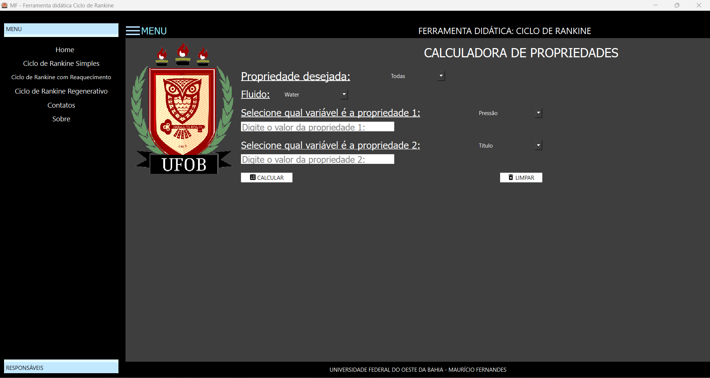
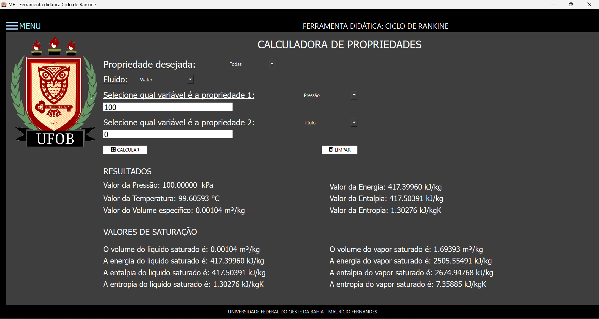
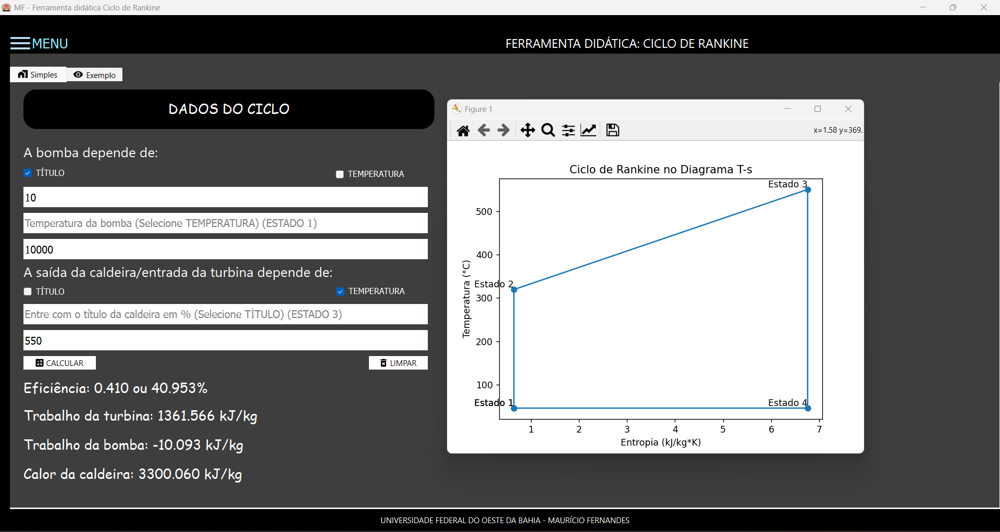
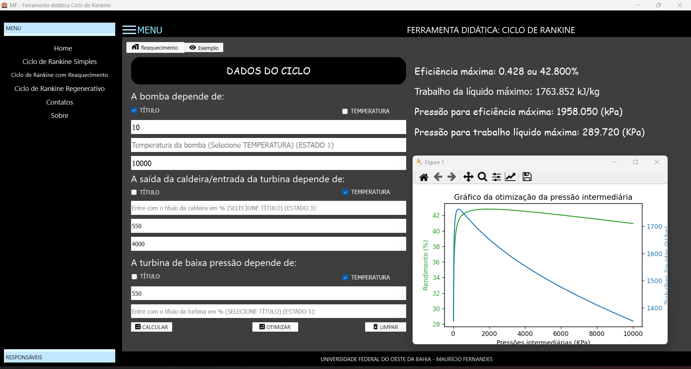

# Ferramenta Didática Ciclo de Rankine

## Descrição

Este software, desenvolvido em Python com uma interface gráfica intuitiva, é dedicado ao estudo e otimização do ciclo de Rankine. Ele foi projetado para facilitar a obtenção de propriedades termodinâmicas e realizar cálculos de ciclos de Rankine de forma eficiente e precisa. O software abrange diversas variantes do ciclo de Rankine, incluindo:

- Ciclo de Rankine Simples
- Ciclo de Rankine com Reaquecimento (com otimização deste ciclo)
- Ciclo de Rankine Regenerativo
- Ciclo de Rankine Regenerativo com Reaquecimento

## Funcionalidades

- **Cálculo de Propriedades Termodinâmicas:** Utiliza a biblioteca CoolProp para calcular propriedades de diversos fluidos, como água, amônia, butano e R134a.
- **Interface Gráfica Intuitiva:** Facilita a interação do usuário, tornando o processo de aprendizado mais intuitivo.
- **Otimização de Processos:** Implementa algoritmos que ajudam na otimização dos ciclos, especialmente no ciclo de reaquecimento.

## Objetivos

O principal objetivo do desenvolvimento deste software foi aplicar na prática os conhecimentos adquiridos em Python e criar uma ferramenta útil para a comunidade acadêmica da Universidade Federal do Oeste da Bahia (UFOB). Este software é especialmente útil para as disciplinas de Termodinâmica Básica, Termodinâmica Aplicada, Sistemas Térmicos e Refrigeração, permitindo aos alunos e professores otimizar seu tempo e esforços, focando mais na análise e interpretação dos resultados do que nos cálculos repetitivos.

## Interface do Usuário

Nossa interface do usuário é projetada para ser intuitiva e fácil de usar. A janela principal fornece acesso rápido a todas as funcionalidades principais do software, incluindo a definição de parâmetros do ciclo, visualização de resultados e opções de otimização.



## Janela de Propriedades

Na janela de propriedades, você pode definir todas as propriedades termodinâmicas dos componentes do ciclo. Aqui, você pode ajustar parâmetros como temperatura, pressão, eficiência e mais. Isso permite uma personalização detalhada do ciclo, adequada para análises específicas.



## Ciclo de Rankine Simples

O ciclo de Rankine simples é um ciclo termodinâmico fundamental para a geração de energia. Nosso software permite simular este ciclo, fornecendo gráficos e dados detalhados sobre seu desempenho. Abaixo está uma visualização do ciclo de Rankine simples.



## Otimização do Ciclo de Reaquecimento

A otimização do ciclo de reaquecimento é crucial para aumentar a eficiência dos sistemas de geração de energia. Nosso software oferece ferramentas avançadas para analisar e otimizar este ciclo, ajudando a identificar os melhores parâmetros de operação. Abaixo está um exemplo de otimização do ciclo de reaquecimento.



## Instalação

1. Clone este repositório:
   ```bash
   git clone https://github.com/mauriciofernandes123/CICLO-DE-RANKINE.git

2. Extraia o arquivo compactado e abre o diretório no terminal ou IDE:

## No Linux

3. Criar o ambiente virtual:
   ```bash
   python3 -m venv venv
   
4. Comando para ativar o ambiente virtual
   ```bash
   source /venv/bin/activate
   
5. Comando para instalar as bibliotecas:
     ```bash
      pip install -r requirements.txt
     
6. Execute o main.py 
   ```bash
      python3 main.py

## No terminal Windows e IDE

3. Comando para criar o ambiente virtual:
   ```bash
   python3 -m venv venv
   
4. Comando para ativar o ambiente virtual (Apenas para terminal Windows):
   ```bash
   /venv/Scripts/activate

5. Comando para instalar as bibliotecas:
     ```bash
      pip install -r requirements.txt

6. Execute o main.py 
   ```bash
      python3 main.py
